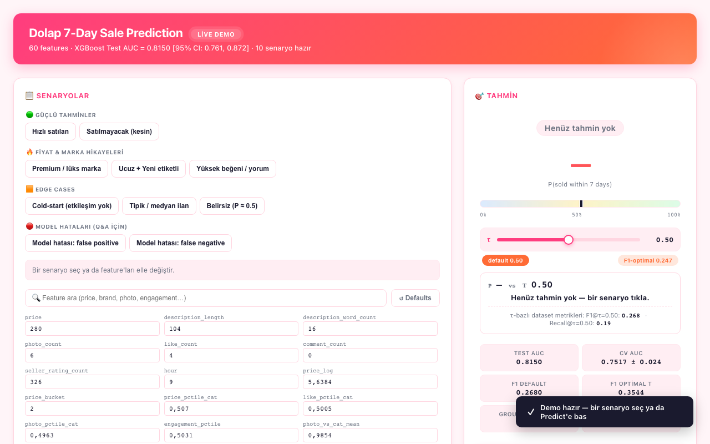
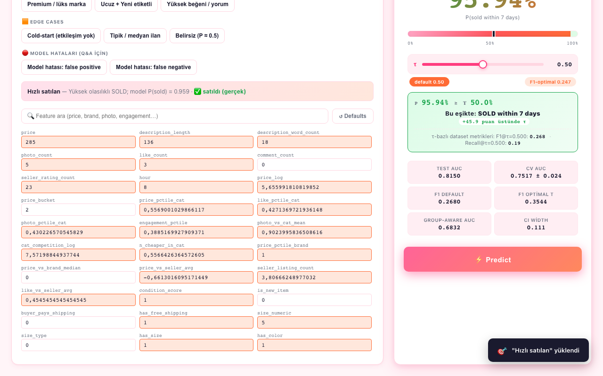
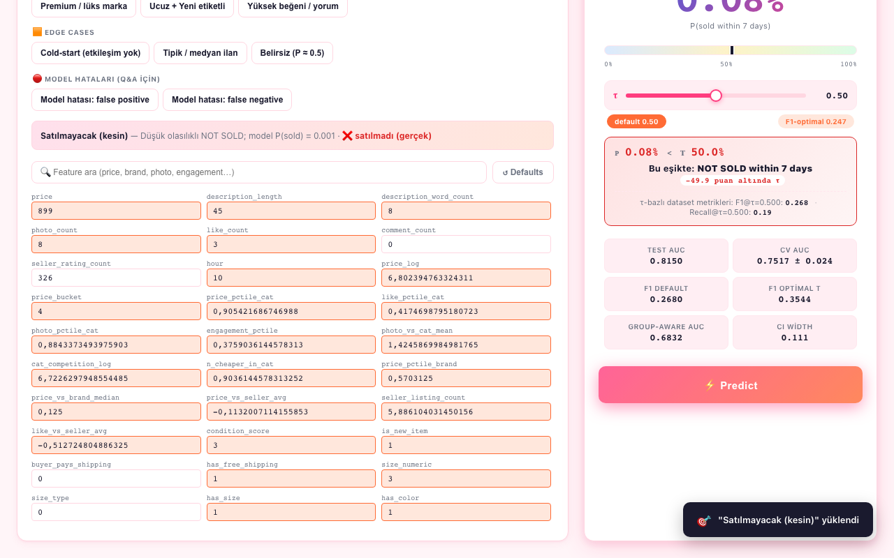
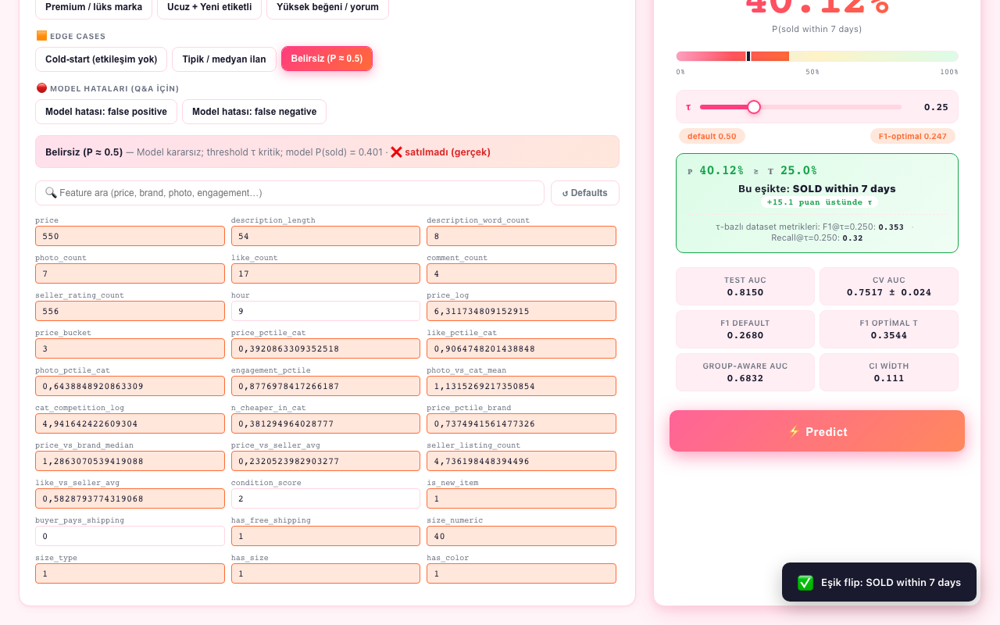

# Dolap Sale Prediction — 7 Günlük Satış Tahmini

> Bir Dolap.com ikinci el moda ilanının özelliklerine bakarak **7 gün içinde satılıp satılmayacağını** tahmin eden uçtan uca makine öğrenmesi projesi. Veri toplama (scraping), zamana duyarlı etiketleme, özellik mühendisliği, model karşılaştırma, ablasyon analizi ve canlı demo dahil.

<div align="center">

[](https://www.python.org/)
[](LICENSE)
[](https://xgboost.readthedocs.io/)
[](#sonuçlar)
[](#canlı-demo)

</div>

---

## 🖼️ Demo & Screenshots

The interactive demo is built with Flask and vanilla JS, and runs entirely locally against the trained XGBoost pipeline. Screenshots below cover the four main views of the application.

<br>

<div align="center">

| View | Description |
|:----:|-------------|
| **① Prediction Panel** | Enter any of the 60 features (pre-filled with training medians), hit **Predict**, and instantly receive a `SOLD` / `NOT SOLD` verdict with a calibrated probability gauge. |
| **② Threshold Explainer** | Drag the decision threshold slider (τ) from 0 to 1 to observe real-time precision–recall trade-offs. Default: 0.50 · F1-optimal: **0.247**. |
| **③ SHAP Feature Importance** | Waterfall and bar plots generated on-the-fly, showing which features pushed the prediction up or down and by how much. |
| **④ ROC Curve Comparison** | Overlapping ROC curves for all six trained models, with 95 % bootstrap confidence bands around the XGBoost curve. |

</div>

<br>

<!-- Replace the lines below with real screenshots once captured -->
<!-- Recommended: 1280 × 800 px, saved as assets/screenshot{1-4}.png        -->






> **Adding screenshots** — copy your captures to `assets/screenshot{1..4}.png` and push.  
> The `assets/` directory is already tracked in the repository.

---

## İçindekiler

- [Proje Özeti](#proje-özeti)
- [Demo & Screenshots](#️-demo--screenshots)
- [Sonuçlar](#sonuçlar)
- [Veri ve Etiketleme Akışı](#veri-ve-etiketleme-akışı)
- [Özellik Seti](#özellik-seti)
- [Proje Yapısı](#proje-yapısı)
- [Kurulum](#kurulum)
- [Kullanım](#kullanım)
- [Canlı Demo](#canlı-demo)
- [Notebook'lar](#notebooklar)
- [Önemli Tasarım Notları](#önemli-tasarım-notları)
- [Lisans](#lisans)

---

## Proje Özeti

İkinci el moda pazarlarında en kritik soru: **"Bu ilan ne kadar sürede satar?"** Bu proje, bir Dolap ilanı yayına alındıktan **7 gün içinde satılıp satılmayacağını** ikili sınıflandırma problemi olarak ele alır.

**Ana zorluklar:**

| Zorluk | Açıklama |
|--------|----------|
| **Yoğun sınıf dengesizliği** | Gerçek pazarda 7 günde satılma oranı ~%5.8'dir |
| **Sızıntı riski (data leakage)** | Satıcı bazlı özelliklerin zamansal ve grup düzeyinde sızıntı yapma riski; ayrı bir deney (`scripts/seller_leakage_experiment.py`) ve grup-farkında split ile değerlendirildi |
| **Soğuk başlangıç (cold-start)** | Production'da yeni ilanda beğeni/yorum sayıları sıfırdır; bunun etkisi **STATIC_ONLY** ablasyonunda ölçüldü |

**Yaklaşım özet:**

```
Dolap.com kohort scrape
  → 7 gün bekleme & otomatik etiketleme
  → 60 özelliklik dataset (6.007 ilan)
  → XGBoost + 5 baseline karşılaştırma
  → SHAP yorumlama + eşik optimizasyonu
  → Canlı Flask demo
```

---

## Sonuçlar

Test seti: **1.202 ilan** (toplamın %20'si), satıldı oranı %5.8. Tüm metrikler `notebooks/dolap_classification_final.ipynb` ve `reports/ablation_results.json` üzerinden donduruldu. CI'lar 1000-iter bootstrap.

### Model Karşılaştırması (Tablo 7)

| Model               | Accuracy | Precision | Recall | F1 | ROC-AUC | 95% CI |
|---------------------|---------:|----------:|-------:|---:|--------:|:-------|
| **XGBoost**         |  0.9409  |  0.4815   | 0.1857 | 0.2680 | **0.8150** | [0.7613, 0.8722] |
| LightGBM            |  0.9434  |  0.5333   | 0.2286 | 0.3200 | 0.7798 | [0.7225, 0.8426] |
| Random Forest       |  0.9351  |  0.3462   | 0.1286 | 0.1875 | 0.7604 | [0.7022, 0.8207] |
| Logistic Regression |  0.7313  |  0.1224   | 0.5857 | 0.2025 | 0.7206 | [0.6613, 0.7864] |
| Decision Tree       |  0.8344  |  0.1692   | 0.4714 | 0.2491 | 0.7116 | [0.6432, 0.7841] |
| KNN                 |  0.7288  |  0.1168   | 0.5571 | 0.1931 | 0.6964 | [0.6364, 0.7612] |

### Ablasyon (Özellik Aileleri)

| Varyant | # Özellik | ROC-AUC | Δ vs FULL |
|---------|----------:|--------:|----------:|
| **FULL (referans)** | 60 | 0.8150 | — |
| NO_ENGAGEMENT (beğeni/yorum çıkarıldı) | 49 | 0.8097 | −0.0053 |
| STATIC_ONLY (cold-start: sadece statik özellikler) | 26 | 0.7491 | −0.0659 |

> Soğuk başlangıç senaryosunda dahi model anlamlı bir sinyal üretmeye devam ediyor (0.749 AUC); etkileşim özellikleri (beğeni/yorum) marjinal katkı sağlıyor ancak bağımsız bir sinyal değil — büyük katkı fiyat / marka / kategori / satıcı tabanlı statik özelliklerden geliyor.

### Robustness — Grup-Farkında Split

| Protokol | ROC-AUC | F1 |
|----------|--------:|---:|
| A — rastgele split | 0.7755 | 0.4421 |
| B — `seller_id` grup-farkında split | 0.6832 | 0.0000 |

> Δ AUC = **−0.0922**. Aynı satıcının ilanları train/test'te ayrılınca performans düşüyor — satıcı-spesifik sinyal gerçek ama bu davranış raporda **şeffaf biçimde belgelendi** ([reports/methodology_addendum.md](reports/methodology_addendum.md)).

---

## Veri ve Etiketleme Akışı

```
    Gün 0                    Gün 7                    Gün 7+
 ┌──────────┐          ┌──────────────┐         ┌────────────────┐
 │ SCRAPE   │          │ LABEL CHECK  │         │ MERGE & BUILD  │
 │ ilan +   │  7 gün   │ Satıldı?     │         │ özellik müh.   │
 │ satıcı   │ ──────►  │ 0 / 1        │ ──────► │ → train-ready  │
 │ verisi   │  bekle   │ (badge/404)  │         │   dataset      │
 └──────────┘          └──────────────┘         └────────────────┘
   cohort_YYYYMMDD       labels/                  data/processed/
```

**Kritik tasarım kararı:** Engagement özellikleri (`like_count`, `comment_count`, `engagement_score`, vs.) yalnızca **ilk scrape anında** dondurulur. 7 gün sonraki etiketleme ziyareti ([src/labeling/status_checker.py](src/labeling/status_checker.py)) sadece satış durumunu kontrol eder ve engagement alanlarını **güncellemez**. Böylece etiket-tanımlama penceresi içinden hedef değişkene sızıntı önlenir.

**Cohort'lar:** `data/raw_snapshots/cohort_YYYYMMDD/` altında 3 kohort (20250712, 20260308, 20260311). Toplam **6.007 etiketli ilan**.

---

## Özellik Seti

Toplam **60 özellik**, ailelere göre:

| Aile | Başlıca Özellikler |
|------|--------------------|
| **Fiyat** | `price`, `price_log`, `price_to_category_median`, `price_to_brand_median`, `price_pctile_cat` |
| **Marka & kategori** | `brand_tier` (1=budget → 5=luxury), `brand_enc`, `category_enc`, `category_freq`, `cat_competition_log` |
| **Ürün durumu** | `condition_ordinal`, `condition_score`, `cheap_and_new` |
| **Açıklama kalitesi** | `description_length`, `desc_has_urgency_keyword`, `desc_has_flaw_mention`, `desc_has_measurement`, `desc_has_quality`, `desc_is_placeholder` |
| **Görsel** | `photo_count`, `desc_depth_per_photo`, `like_per_photo`, `comment_per_photo` |
| **Satıcı** | `seller_listing_count`, `seller_rating_count`, `seller_frequency_log`, `seller_balance_weight` |
| **Etkileşim (engagement)** | `like_count`, `comment_count`, `engagement_score`, `engagement_pctile`, `has_likes`, `has_comments`, `engagement_x_new`, `like_vs_seller_avg` |
| **Zamansal** | `listing_hour`, `listing_dow`, `is_weekend_listing` |
| **Lojistik** | `buyer_pays_shipping` |

Tam liste ve provenance: [reports/feature_set_provenance.md](reports/feature_set_provenance.md)

---

## Proje Yapısı

```
dolap-sale-prediction/
├── assets/                          # 📸 README görselleri (screenshot*.png buraya)
├── configs/                         # YAML konfigürasyon
│   ├── scraping.yaml                #   scraper rate-limit, retry, paths
│   ├── features.yaml                #   marka tier mapping, aileler
│   ├── model.yaml                   #   model + hiperparametreler
│   └── pipeline.yaml                #   orchestrator ayarları
├── data/                            # Tüm veri katmanları (git-ignored)
│   ├── raw_snapshots/               #   cohort_YYYYMMDD/ ham JSONL
│   ├── labels/                      #   7-gün sonrası etiketler
│   ├── interim/                     #   ara join sonuçları
│   └── processed/                   #   model_ready_v3.csv (6007 × 61)
├── src/
│   ├── scraping/                    # parsers.py, scraper.py, rate_limiter.py
│   ├── labeling/                    # status_checker.py, labeler.py
│   ├── preprocessing/               # clean_features.py, cleaner.py
│   ├── features/                    # engineer.py
│   ├── pipelines/                   # scrape / label / build_dataset / train / evaluate
│   └── utils/                       # config, logging, DB ortak araçlar
├── notebooks/
│   ├── Dolap_EDA_Feature_Engineering.ipynb
│   ├── dolap_classification_final.ipynb     # ana sonuç notebook'u
│   └── dolap_ablation_study.ipynb           # ablasyon + bootstrap CI
├── scripts/
│   ├── analyze_target_variable.py
│   ├── check_scrape_quality.py
│   ├── label_all_data.py
│   ├── merge_labels_to_dataset.py
│   ├── seller_leakage_experiment.py         # grup-farkında split deneyi
│   └── validate_cohort.py
├── demo/                            # Canlı tahmin demosu (Flask + vanilla JS)
│   ├── demo_server.py
│   ├── demo_ui.html
│   └── README.md
├── reports/
│   ├── ablation_results.json                # source-of-truth metrikler
│   ├── methodology_addendum.md              # raporda gözden geçirilmiş bölümler
│   └── feature_set_provenance.md
├── models/
│   ├── dolap_xgboost_pipeline.joblib        # production model artefaktı
│   └── feature_schema.json
├── artifacts/                       # figures, metrics, experiments (git-ignored)
├── tests/
├── pyproject.toml
└── requirements.txt
```

---

## Kurulum

```bash
git clone https://github.com/thefcan/dolap-sale-prediction.git
cd dolap-sale-prediction

python -m venv .venv
source .venv/bin/activate            # Windows: .venv\Scripts\activate

pip install -r requirements.txt
cp .env.example .env                 # Gerekirse env değişkenlerini düzenle
```

**Gereksinimler:** Python 3.10+, pandas, scikit-learn, XGBoost, LightGBM, SHAP, Optuna, Flask (demo için).

---

## Kullanım

### 1. Ham veriyi scrape et

```bash
python -m src.pipelines.scrape --config configs/scraping.yaml
# Çıktı: data/raw_snapshots/cohort_<bugün>/listings.jsonl
```

### 2. 7 gün sonra satış durumunu etiketle

```bash
python -m src.pipelines.label --cohort cohort_20260308
# veya tüm kohortlar için:
python scripts/label_all_data.py
```

### 3. Train-ready dataset'i oluştur

```bash
python -m src.pipelines.build_dataset
python -m src.features.engineer
# Çıktı: data/processed/engineered_features.parquet
```

### 4. Modeli eğit ve değerlendir

Ana notebook üzerinden tüm sonuçları yeniden üretmek için:

```bash
jupyter lab notebooks/dolap_classification_final.ipynb
# "Restart & Run All" — son hücre joblib model artefaktını models/ altına yazar
```

### 5. Satıcı sızıntısı (group-aware) deneyini koştur

```bash
python scripts/seller_leakage_experiment.py
```

---

## Canlı Demo

XGBoost pipeline'ını tarayıcı üzerinden interaktif olarak deneyebilirsiniz:

```bash
# Önce model artefaktının var olduğundan emin olun
ls models/dolap_xgboost_pipeline.joblib

# Flask sunucusunu başlatın
pip install flask flask-cors
python demo/demo_server.py

# http://127.0.0.1:5000/ adresine gidin
```

| Demo Özelliği | Açıklama |
|---------------|----------|
| **60 numerik özellik input'u** | Training median'larıyla pre-fill, arama kutusu, reset |
| **Karar eşiği slider (τ)** | Varsayılan 0.50, F1-optimal 0.247 |
| **Canlı tahmin paneli** | Etiket (SOLD / NOT SOLD), olasılık, gauge, headline metrikler |
| **Threshold-explainer panel** | Slider hareket ettikçe karar anlık güncelleniyor |

Detaylı demo akışı: [demo/README.md](demo/README.md)

---

## Notebook'lar

| Notebook | Amaç |
|----------|------|
| [Dolap_EDA_Feature_Engineering.ipynb](notebooks/Dolap_EDA_Feature_Engineering.ipynb) | Keşifsel veri analizi + feature engineering ilk turu |
| [dolap_classification_final.ipynb](notebooks/dolap_classification_final.ipynb) | 6 model karşılaştırma, SHAP, eşik optimizasyonu, joblib export |
| [dolap_ablation_study.ipynb](notebooks/dolap_ablation_study.ipynb) | Özellik ailesi ablasyonu + bootstrap CI |

---

## Önemli Tasarım Notları

- **Sınıf dengesizliği:** SMOTE yalnızca train fold'una uygulanıyor; test seti orijinal dağılımda bırakılıyor.
- **Eşik optimizasyonu:** F1-maximizing eşik 0.247 (varsayılan 0.50'den farklı). Demo'da slider ile gözlemlenebilir.
- **Bootstrap CI:** Tüm AUC değerleri 1000-iter test-seti resampling ile %95 CI olarak raporlanıyor.
- **Sızıntı kontrolü:** Engagement özellikleri sadece T=0 anında alınır; satıcı bazlı sızıntı için grup-farkında split ile şeffaf düşüş raporlandı (−0.092 AUC).

---

## Lisans

MIT — Detaylar: [LICENSE](LICENSE)

---

## Yazar

**Furkan Karafil** — [@thefcan](https://github.com/thefcan)
